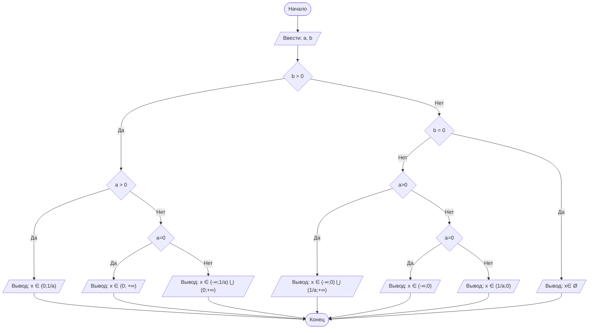

4# Lab1
## Отчет по лабораторной работе № 1

#### № группы: `ПМ-2101`

#### Выполнил: `Шлярд Екатерина Владимровна`

#### Вариант: `30`

### Cодержание:

- [Постановка задачи](#1-постановка-задачи)
- [Входные и выходные данные](#2-входные-и-выходные-данные)
- [Выбор структуры данных](#3-выбор-структуры-данных)
- [Алгоритм](#4-алгоритм)
- [Программа](#5-программа)
- [Анализ правильности решения](#6-анализ-правильности-решения)

### 1. Постановка задачи

> Дано неравенство:
(x · a − 1)/
b · x
< 0
Где a и b — параметры (вводятся с клавиатуры). Решите его для x.
Решение неравенства, подходящий промежуток для х, зависит от значений параметров а и b. Нужно написать программу, которая для любой пары а и b выведет промежуток для х, удовлетворяющий условию неравенства.
Для решения неравенства прогрумма должна рассмотреть все возможные случаи значений для а и b,а именно когда:
1. b>0 и a>0
2. b>0 и a=0
3. b>0 и a<0
4. b=0
5. b<0 и a>0
6. b<0 и a=0
7. b<0 и a<0 

### 2. Входные и выходные данные

#### Данные на вход

ННа вход программа должна получать 2 числа, при этом в условии не сказано, к какому множеству
принадлежат получаемые числа, поэтому будем считать их вещественными. Верхняя и нижняя границы получаемых
чисел есть диапазон допустимых значений типа double.

|             | Тип                | min значение    | max значение   |
|-------------|--------------------|-----------------|----------------|
| a (Число 1) | Вещественное число |-(1.79<sup>308</sup>)|1.79<sup>308</sup>|
| b (Число 2) | Вещественное число |-(1.79<sup>308</sup>)|1.79<sup>308</sup>|

#### Данные на выход

Программа в зависимости от введенных параметров выводит решение неравенства.   
Решение выводится в виде строчки(множества решений). 

|         | Тип                                | min  | max значение   |
|---------|------------------------------------|--------------|----------------|
| Логическое выражение | Строка | -        | - |

### 3. Выбор структуры данных

Программа получает 2 вещественных числа, не превышающих по модулю 10<sup>9</sup> < 2<sup>30</sup>. Поэтому для их хранения
можно выделить 2 переменных (`a` и `b`) типа `double`.

|             | название переменной | Тип (в Java) | 
|-------------|---------------------|--------------|
| a (Число 1) | `a`                 | `double`     |
| b (Число 2) | `a`                 | `double`     | 

Для вывода результата необязательно его хранить в отдельной переменной.

### 4. Алгоритм

#### Алгоритм выполнения программы:
Если b = 0, конец алгоритма, вывод ошибки     
 Если b ≠ 0, нужно понять, поменяется ли знак неравенства.     
   
   -Если b > 0, знак остается таким же.       
   *Если a = 0, то x ≠ 0*   
   *Если -a < 0, то x ∈ (-∞ ; -a] ∪ (0 ; +∞)*    
   *Если -a > 0, то x ∈ (-∞ ; 0) ∪ [-a ; +∞)*
  
   -Если b < 0, знак менеятся.    
   *Если a = 0, то x ∈ Ø.*   
   *Если -a < 0, то x ∈ [-a ; 0)*    
   *Если -a > 0, то x ∈ (0 ; -a)*e

1. **Ввод данных:**  
   Программа считывает два вещественных числа, обозначенные как `a` и `b`.

2. **Сравнение чисел:**  
   Программа сравнивает значения `x` и `y`. Если `x` больше или равно `y`, программа переходит к следующему шагу для
   работы с `x`. Если `y` больше, программа выполняет действия для работы с `y`.

3. **Проверка знака для выбранного числа:**
    - Если было выбрано число `x` (так как оно больше или равно `y`), проверяется, положительное оно или отрицательное.
      Если `x` положительное, оно выводится на экран. Если отрицательное, выводится его модуль (т.е. противоположное
      по знаку значение).
    - Если было выбрано число `y` (поскольку оно больше `x`), выполняется аналогичная проверка. Если `y` положительное,
      оно выводится на экран. Если отрицательное, выводится его модуль.

4. **Вывод результата:**  
   На экран выводится либо большее из чисел, либо его модуль, если это число отрицательное.

#### Блок-схема



### 5. Программа

```java
import java.io.PrintStream;
import java.util.Scanner;
public class Main {
    public static Scanner in = new Scanner(System.in);
    public static PrintStream out = System.out;
    public static void main(String[] args) {
        double a = in.nextDouble();//вводим с клавиатуры вещественные числа а и b//
        double b = in.nextDouble();
        if (b>0){ //начинаю рассматривать врианты. Первый - если коэф. b >0//
           if (a >0){ //при b >0 рассматриваю первый случай - коэф. а - положительный//
               out.println("x ∈ (0;");
               out.print(1/a);
               out.print(")");
            }
           else if (a == 0){ // второй случай при b>0 - коэф. а равен нулю//
               out.println("x ∈ (0; +∞)");
           }
           else { // третий случай при b>0 - коэф. а отрицательный //
               out.println("x ∈ (-∞;");
               out.print(1/a);
               out.print(") ⋃ (0;+∞)");
           }
        }
        else if (b==0){ //второй случай для коэф. b - если он равен нулю. В такой ситуации нет решений у неравенства//
            out.println("x ∈ Ø");
        }
        else { //последний возможный случай для коэф. b - если он отрицательный//
            if (a >0){ //случай b<0  и a>0//
                out.println("x ∈ (-∞;0) ⋃ (");
                out.print(1/a);
                out.print(";+∞)");
            }
            else if(a ==0){//случай: b<0 и a=0//
                out.println("x ∈ (-∞;0)");
            }
            else{ //случай: b<0 и a<0//
                out.println("x ∈ (");
                out.print(1/a);
                out.print(";0)");
            }
        }
    }
}
           
```

### 6. Анализ правильности решения

Программа работает корректно на всем множестве решений с учетом ограничений.

1. Тест на `b > 0 и a > 0`:

    - **Input**:
        ```
        5 1.3
        ```

    - **Output**:
        ```
        5
        ```

2. Тест на `b > 0 и  a = 0`:

    - **Input**:
        ```
        -4 -2.2
        ```

    - **Output**:
        ```
        2.2
        ```

3. Тест на `b > 0 и a < 0`:

    - **Input**:
        ```
        -4 5
        ```

    - **Output**:
        ```
        5
        ```

4. Тест на `b = 0`:

    - **Input**:
        ```
        0 -3
        ```

    - **Output**:
        ```
        3
        ```

5. Тест на `b < 0 и a > 0`::

    - **Input**:
        ```
        -1000000000 1000000000
        ```

    - **Output**:
        ```
        1000000000
        ```
5. Тест на `b < 0 и a = 0`::

    - **Input**:
        ```
        -1000000000 1000000000
        ```

    - **Output**:
        ```
        1000000000
        ```
5. Тест на `b < 0 и a < 0`::

    - **Input**:
        ```
        -1000000000 1000000000
        ```

    - **Output**:
        ```
        1000000000
        ```
